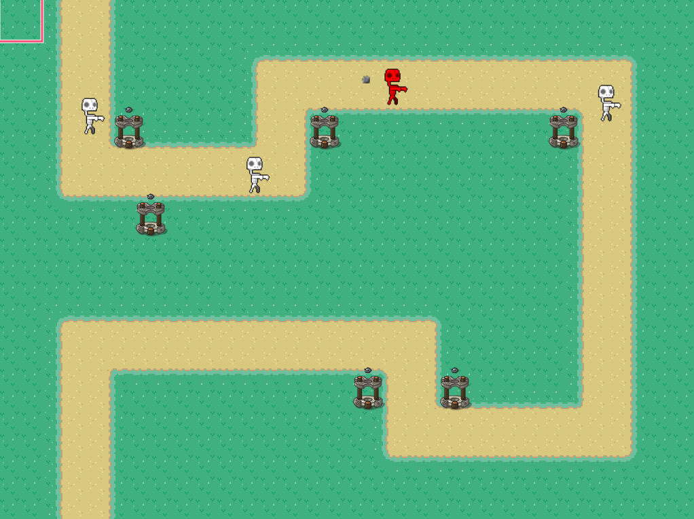

# Game-Over
-   Game assignment using phaser.js to build this tower defense game

### Made by:

-   Adrian Jungnelius - [@AdrianJung](https://github.com/AdrianJung)
-   Isac Larsson - [@WebDevIsac](https://github.com/WebDevIsac)

## Usage

-   [Play Game](https://tower-defense-game.netlify.com/) hosted with [Netlify](https://www.netlify.com/)

## Installation

Clone this repo.

-   `$ git clone https://github.com/AdrianJung/Game-Over/`

Install dependencies

-   `$ npm install`

Starting server and client

-   `$ npm start`

## Testers

-   [André Broman](https://github.com/brooman)
-   [Fredrik Leemann](https://github.com/freddan88)
-   [Samuel Johansson](https://github.com/WebSamuel90)
-   [Isa Areschoug](https://github.com/Neyrin)

Non-programmers:

-   Isabell Holm-lindmark
-   Adam Vallin
-   Max Jungnelius
-   Simon Boman

### Comments by group 03
-   Well commented code
-   Well and consistently indented
-   Easily understandable variable names
-   Good structure and division of files
-   __game/assets/sprites__ - Inconsistant use of snake- and kebab-case in filenames
-   __index.html:14__ - Phaser seems to be installed using npm _and_ imported via cdn
-   __app/style__ - Folder seems redundant
-   __scenes/StartScene.js:37 & scenes/EndScene.js:46__ - Empty unexplained Update-function
-   __GameScene.js:207__ - Great use of grid
-   __GameScene.js:204__ - Code left commented out

## Pull requests

-   [#1 Game setup](https://github.com/AdrianJung/Game-Over/pull/1)
-   [#2 Removed cache](https://github.com/AdrianJung/Game-Over/pull/2)
-   [#3 Project structure](https://github.com/AdrianJung/Game-Over/pull/3)
-   [#4 Added enemies and started on pathing](https://github.com/AdrianJung/Game-Over/pull/4)
-   [#5 Creating towers and add to game functions](https://github.com/AdrianJung/Game-Over/pull/5)
-   [#6 Refactoring and adding classes](https://github.com/AdrianJung/Game-Over/pull/6)
-   [#7 Changing bullets and towers](https://github.com/AdrianJung/Game-Over/pull/7)
-   [#8 New enemy functions, merged with new map and new towers](https://github.com/AdrianJung/Game-Over/pull/8)
-   [#9 Removed dist](https://github.com/AdrianJung/Game-Over/pull/9)
-   [#10 Scaling and startscene](https://github.com/AdrianJung/Game-Over/pull/10)
-   [#11 Side-menu and enemy functions](https://github.com/AdrianJung/Game-Over/pull/11)
-   [#12 Added enemy type](https://github.com/AdrianJung/Game-Over/pull/12)
-   [#13 More work on towers and fixes](https://github.com/AdrianJung/Game-Over/pull/13)
-   [#14 Money and health counter](https://github.com/AdrianJung/Game-Over/pull/14)
-   [#15 Adding grid, tower radius and tower icons](https://github.com/AdrianJung/Game-Over/pull/15)
-   [#16 Added scaling to enemies, new enemy and moved class folder](https://github.com/AdrianJung/Game-Over/pull/16)
-   [#17 Endscene](https://github.com/AdrianJung/Game-Over/pull/17)
-   [#18 GameWon Scene and final fixes](https://github.com/AdrianJung/Game-Over/pull/18)
-   [#19 Create README.md file](https://github.com/AdrianJung/Game-Over/pull/19)
-   [#20 Update README.md with comments on code](https://github.com/AdrianJung/Game-Over/pull/20)
-   [#21 Update README.md with latest pull request logs and adding github profiles](https://github.com/AdrianJung/Game-Over/pull/21)
